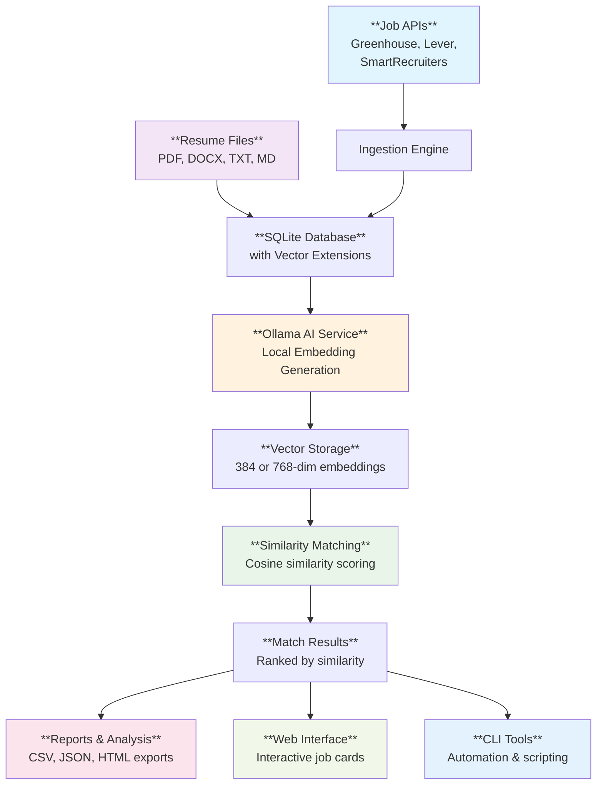

<div align="center">
  
  
  # SoupBoss
  
  **Semi-Intelligent Job Matching System with Semantic Similarity Scoring**
  
  [](https://www.python.org/downloads/)
  [](https://github.com/astral-sh/uv)
  [](https://ollama.com)
 	[](https://www.anthropic.com/claude-code)
  [](https://flask.palletsprojects.com/en/stable/)
 
</div>

## Overview

SoupBoss is an intelligent job matching system that leverages AI-powered semantic similarity to connect resumes with job opportunities. It features both a **flask web interface** and a **CLI** for different use cases, processing job postings from multiple sources with sophisticated AI matching and comprehensive reporting.

## Forward
Job titles and descriptions vary wildly across companies. Am I a DevOps Engineer? An SRE? A Product Owner? Searching job boards often feels like guessing keywords and scrolling endlessly.

SoupBoss solves this by semantically matching your resume against job postings. Instead of keyword searches, it uses embeddings (via Ollama) to find roles that best align with your background.

#### Why the Name SoupBoss?

Think of job matching like making soup:
- The ingredients are skills, experience, and job requirements
- The recipe is how they come together
- SoupBoss is the chef — mixing, tasting, and serving up the best matches

Instead of forcing you to pick search terms, it stirs everything together to surface roles that “taste right” for your background.


| What SoupBoss is **Not** |  SoupBoss **Is** |
|------------------------------|--------------------------|
| - ❌ An auto-downloader of job postings <br> - ❌ An auto-submitter of applications <br> - ❌ A tool that links back to postings | 1. Import (fetch) job postings <br> 2. Add your resume(s) <br> 3. Generate embeddings for both <br> 4. Run the matcher to surface top fits <br> 5. Apply directly via the company site |

## Screenshots 

| Web Interface |  CLI  |
|------------------------------|--------------------------|
|      |      |
|      |      |
|      |      |
|      |      |
|      |      |
|      |      |


## Prerequisites

### Required Software
- **Python 3.13+** (required for modern language features)
- **[uv package manager](https://github.com/astral-sh/uv)** (critical - do not use pip)
- **[Ollama](https://ollama.com)** installed and running locally

### Ollama Setup

**⚠️ CRITICAL: SoupBoss requires Ollama running locally on your machine.**

SoupBoss connects directly to Ollama (default: `localhost:11434`) for all AI operations. It could be converted to using API's.  

```bash
# Install Ollama from https://ollama.com
# Then pull an embedding model:
ollama pull nomic-embed-text
# or
ollama pull bge-large
```

## 🚀 Quick Start

### 🌐 Web Interface (Recommended for Most Users)

**Fastest way to get started:**

```bash
# Start the web interface
./restart_webapp.sh

# Then open in any browser:
# http://localhost:5000
```


### ⚡ CLI Interface (Power Users & Automation)

**For scripting and advanced features:**

```bash
# Install dependencies (uv handles everything automatically)
uv sync

# Verify installation and check Ollama connection
uv run python main.py status

# Test embedding functionality
uv run python main.py test-embedding
```

## 🎯 Complete Workflows

### 🌐 Web Interface Workflow

**Visual, step-by-step process:**

1. **Start**: Run `./restart_webapp.sh` and open `http://localhost:5000`
2. **Upload**: Drag-and-drop your resume files to the upload area
3. **Test Company**: Enter company name (e.g., "spacex") and click "Test Company"
4. **Add Company**: If test succeeds, click "Add Company"
5. **Fetch Jobs**: Click "Fetch Jobs" to retrieve postings with real-time progress
6. **Generate Embeddings**: Click "Generate Embeddings" (force regenerate if needed)
7. **Run Matching**: Click "Run Matching" to execute AI similarity scoring
8. **View Results**: Switch to "Results & Matches" tab to see professional job cards
9. **Sort & Filter**: Use dropdown to sort by similarity, company, title, or date

### ⚡ CLI Workflow

**Command-line power user guide:**

```bash
# 1. Add a company to track
uv run python main.py companies add spacex --source greenhouse

# 2. Test if the company has an active job board
uv run python main.py companies test spacex --source greenhouse

# 3. Fetch jobs from the company
uv run python main.py jobs fetch --source greenhouse --company spacex

# 4. Verify jobs were imported
uv run python main.py jobs list --company spacex

# 5. Add your resume(s)
uv run python main.py resumes add /path/to/resume.pdf --name "My Resume"
uv run python main.py resumes add /path/to/resume.docx --name "Alternative Resume"

# 6. Check resume was processed
uv run python main.py resumes list

# 7. Generate AI embeddings (this takes time but runs once)
uv run python main.py match generate --time

# 8. Run similarity matching
uv run python main.py match run

# 9. View your top 20 matches
uv run python main.py match show 1 --limit 20

# 10. Generate a comprehensive HTML report
uv run python main.py report --format html --output my_matches.html

# 11. View detailed system statistics
uv run python main.py maintenance stats
```

### Bulk Operations

For processing multiple companies or large datasets:

```bash
# Create a companies.txt file with one company per line
echo -e "spacex\ntesla\nopenai" > companies.txt

# Bulk fetch jobs
uv run python main.py jobs fetch --source greenhouse --companies-file companies.txt

# Add multiple resumes at once
uv run python main.py resumes add /resumes/*.pdf

# Export all matches to CSV
uv run python main.py match export --format csv --output all_matches.csv
```

## Architecture

### Core Components

```
soupboss/
├── cli.py                 # Complete CLI interface (40+ commands)
├── db.py                  # SQLite with vector search
├── embeddings.py          # Ollama client integration
├── ingestion.py           # Multi-API job fetching
├── matching.py            # AI similarity engine
├── export.py              # Professional reporting
├── maintenance.py         # System utilities
└── config.py              # Configuration management
```

### Data Flow



## Command Groups

| Group | Purpose | Key Commands | Examples |
|-------|---------|--------------|----------|
| **jobs** | Job data management | `fetch`, `list`, `import` | Ingest from APIs, bulk import |
| **companies** | Company tracking | `add`, `list`, `test` | Manage job sources |
| **resumes** | Resume management | `add`, `show`, `remove` | Process candidate files |
| **match** | AI matching | `generate`, `run`, `show` | Create embeddings, find matches |
| **maintenance** | System upkeep | `stats`, `clear-*`, `backup` | Database maintenance |
| **config** | Configuration | `show`, `set`, `validate` | System settings |

## Supported Integrations / Formats

### Job Board APIs
- **Greenhouse**: `https://boards-api.greenhouse.io/v1/boards/{company}/jobs`
- **Lever**: `https://api.lever.co/v0/postings/{company}`
- **SmartRecruiters**: `https://api.smartrecruiters.com/v1/companies/{company}/postings`

### Resume Formats
- **PDF** (.pdf) - Full text extraction
- **Word Documents** (.docx) - Microsoft Word format
- **Plain Text** (.txt) - Direct text processing
- **Markdown** (.md) - Formatted text with structure

### Export & Reporting
- **CSV** (.csv) - Structured data for Excel/analysis
- **JSON** (.json) - Machine-readable data format
- **HTML** (.html) - Rich formatted reports with styling
- **PDF** (.pdf) - Professional printable reports

## Configuration

SoupBoss uses a flexible configuration system:

```bash
# Environment variables (.env file)
# Note: These setting can also be set in the soupboss.config.json file
OLLAMA_HOST=localhost
OLLAMA_PORT=11434
OLLAMA_MODEL=nomic-embed-text

# View current settings
uv run python main.py config show

# Update Ollama connection
uv run python main.py config env OLLAMA_HOST localhost
uv run python main.py config env OLLAMA_MODEL bge-large

# Database and system settings
uv run python main.py config set database timeout 30
uv run python main.py config set embedding batch_size 100

# Export configuration template
uv run python main.py config template --output .env.example
```

## Standalone Utilities

Direct API access without the main system:

```bash
# Test company job boards
uv run python greenhouse_fetch.py -test spacex
uv run python lever_fetch.py -test leverdemo

# Direct job fetching
uv run python greenhouse_fetch.py -fetch spacex
uv run python smartrecruiters_fetch.py -fetch dynatrace1

# Bulk operations
uv run python greenhouse_fetch.py -in companies.txt -out ./data/

# Import Disney Workday data
uv run python disney_data_importer.py -file disney_jobs.json
```

## Advanced Usage

### Model Comparison & Analysis
```bash
# Compare embedding models for quality and speed
uv run python main.py match compare-models --save comparison.json

# Switch between models
uv run python main.py match switch-model bge-large --generate

# View model statistics
uv run python main.py match list-models
```

### System Maintenance
```bash
# Database optimization
uv run python main.py maintenance optimize

# Data validation
uv run python main.py maintenance validate

# Backup before major operations
uv run python main.py maintenance backup --output backup.db

# Clean start (removes everything)
uv run python main.py maintenance reset-system --force
```

## Documentation

- **[CLI_REFERENCE.md](CLI_REFERENCE.md)** - Complete command reference with examples
- **[CLAUDE.md](CLAUDE.md)** - Claude Code integration and development guide


---

<div align="center">
  <em>Built for intelligent job matching with local AI and complete data control</em>
  <br><br>
  <strong>🌐 Web Interface • ⚡ CLI Power • 🤖 Local AI • 🔒 Complete Privacy</strong>
</div>
